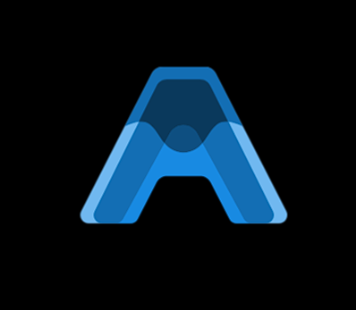

<div align="center">
<a href="https://github.com/shaikhdanialsah/Anirec-Frontend">
  
</a>
  <h3 align="center">Anirec+</h3>

  <h3>Link: <a href="https://anirec.vercel.app/">anirec.vercel.app</a></h3>

   <p align="center">
    📖 Content-Based Anime Recommender System with Graphical Visualization.
  </p>

  🐜 <a href="https://github.com/shaikhdanialsah/Anirec-Frontend/issues">Report Bug</a> | ✨ <a href="https://github.com/shaikhdanialsah/Anirec-Frontend/issues">Request Features</a>
  <br /><br />
  &nbsp;
  &nbsp;
  &nbsp;
  &nbsp;
  &nbsp;
  &nbsp;
  
</div>

# AniRec+ - Frontend

## Overview

This is the frontend for an anime recommendation system built using **React.js**. The frontend interacts with the backend API to allow users to query anime recommendations, view anime details, and register/login. It also integrates a content-based filtering system to recommend anime based on the user's input.

## Features

- **Anime Recommendations**: Users can input an anime title, and the frontend will display a list of recommended animes based on a content-based filtering method (using backend API).
- **User Authentication**: Users can sign up and log in to bookmark their favourite anime and give reviews.

## Technologies Used

- **[React.js](https://react.dev/)**: JavaScript library for building the user interface.
- **[Axios](https://axios-http.com/docs/intro)**: HTTP client for making requests to the backend API.
- **[React Router](https://reactrouter.com/)**: For navigating between different pages (e.g., login, signup, recommendations).
- **[CSS](https://www.w3schools.com/css/)**: For styling the components and layout.
- **JWT (JSON Web Tokens)**: For user authentication and session management.

## UI Libraries
- **[Bootstrap](https://react-bootstrap.netlify.app/)**
- **[Mui-Library](https://mui.com/material-ui/getting-started/)**

## Installation

To run the frontend locally, follow these steps:

### 1. Clone the repository

```bash
git clone https://github.com/yourusername/Anirec-Frontend.git
cd Anirec-Frontend
```

### 2. Install dependencies
```bash
npm install
```

### 3. Run the React app
```bash
npm start
```

### 4. Create .env file to store information about the API url from backend
```bash
REACT_APP_API_URL= YOUR_API_URL
```
If you run the backend locally, the API url would be `http://localhost:5000/api`. Refer [backend documentation](https://github.com/shaikhdanialsah/Anirec-Backend) for more details on setting up the backend.

## Running in Production
To deploy the frontend to Vercel or any other hosting platform, follow these steps:
1. Build the app for production:

```bash
npm run build
```
2. Upload the build/ folder to your hosting platform and make sure the env is configured.

## License
This project is licensed under the MIT License - see the [`LICENSE`](https://choosealicense.com/licenses/mit/) file for details.
